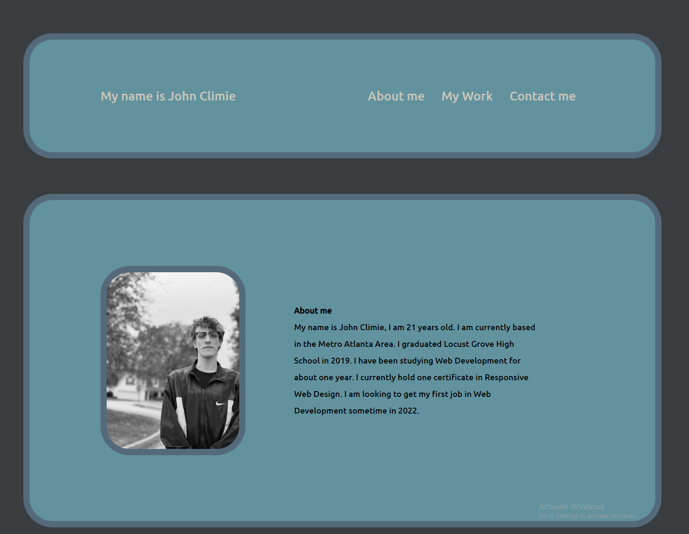

# My New CSS Portfolio

## Description

In this project, I created my own CSS Portfolio.

While working on it, I made it completely from scratch. I started with the header, then the Sections portion, then the Contact Me portion at the bottom. 

Working on the project links was difficult, as one had to be bigger than the rest. It was also diffiuclt to fit the picutres into the container. However, they are responsive, along with the rest of the page.

My links don't deploy to the projects because I don't have any other projects yet. The links in the Contact Me work except for Twitter, I don't have an account right now so I have it linked to the Twitter home page.

Overall, I enjoyed this project a lot. I found it very fun and interesting, as it allowed me to bring out the creative side in me.

**Link** 

GitHub Pages: https://johnclimie.github.io/AdvancedCSSPortfolio/